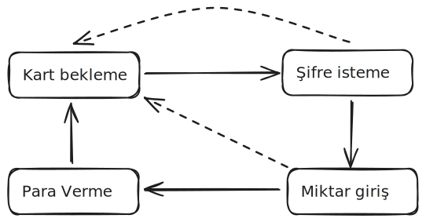
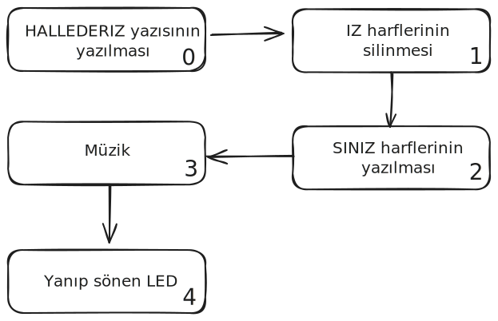
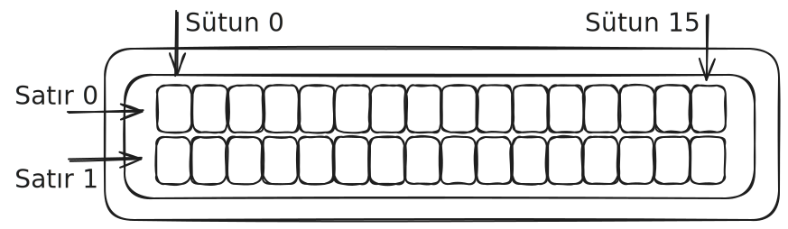

# Proje 08 - LCD Demo Animasyonu

## Giriş

Bu projede Arduino ile etkileşimli bir LCD demo animasyonu yapacağız. LCD ekranında yazı yazma, geri silme, müzik çalma ve LED kontrolü gibi birden fazla özelliği bir arada kullanacaksın. Sanki bilgisayar başında yazı yazıp hata düzeltiyormuş gibi gerçekçi bir animasyon göreceksin! Hatta kiti ilk açtığın zaman üzerinde bu kod yüklü halde gelmişti!

## Elektronik

Bu projede üç farklı modülü birlikte kullanıyoruz. Ama bu derse kadar farklı bir bağlantı yöntemi kullanıyorduk. Şimdi ilk kez **I2C protokolü** ile tanışacağız!

### I2C Protokolü Nedir?

Şu ana kadar tüm projelerimizde modüllerimizi doğrudan Arduino'nun dijital ve analog pinlerine bağlıyorduk. Örneğin LED'i pin 10'a, butonu pin 7'ye bağlamıştık. Her modül için ayrı bir pin kullanmamız gerekiyordu.

**I2C (Inter-Integrated Circuit)** protokolü ise bambaşka çalışır. Sadece **2 hat** kullanarak birden fazla cihazı aynı anda kontrol edebiliriz:

- **SDA (Serial Data)**: Veri hattı - Arduino'nun A4 pinine bağlanır
- **SCL (Serial Clock)**: Saat sinyali hattı - Arduino'nun A5 pinine bağlanır

I2C'nin büyük avantajı şu: Aynı SDA ve SCL hatlarına birden fazla cihaz bağlayıp, her birine **adres** vererek ayrı ayrı kontrol edebiliriz. Bu sayede pin tasarrufu sağlarız ve daha karmaşık projeler yapabiliriz. Mesela bu kitteki 3 Eksen İvmeölçer, Sıcaklık ve Nem sensörü ve Işık sensörü de aynı pinlere bağlanıyor ama adresleri farklı.

**LCD Ekran (16x2)**: I2C protokolüyle Arduino'ya bağlı. SDA ve SCL pinleri üzerinden veri alışverişi yapıyor. LCD'nin **0x21 adresinde** çalıştığını varsayıyoruz. Bu adres, I2C hattındaki LCD'yi diğer cihazlardan ayırt etmemizi sağlar.

**Buzzer**: Pin 3'e bağlı ve önceki buzzer projesindeki gibi çalışıyor. Müzik notalarını çalmak için tone() fonksiyonunu kullanacağız.

**LED**: Pin 10'a bağlı ve animasyon sonunda yanıp sönme efekti yapacak.

LCD'nin cursor() ve blink() özelliklerini kullanarak gerçek bir yazı editörü gibi imleç görünümü sağlayacağız. Bu da animasyonu daha gerçekçi kılacak.

## Yeni Kavramlar

### String Veri Tipi ve Manipülasyonu

**String Sınıfı**: Arduino'da metinsel verileri saklamak ve işlemek için kullanılır. Karakterlerin bir araya gelmesiyle oluşur ve birçok yararlı fonksiyona sahiptir.

**charAt() Fonksiyonu**: Bir String içindeki belirli pozisyondaki karakteri döndürür. `"MERHABA".charAt(0)` ifadesi 'M' karakterini verir. Dizi indeksleri gibi 0'dan başlar.

**length() Fonksiyonu**: String'in kaç karakterden oluştuğunu verir. 

#### Switch-Case 
**Switch-Case**, bir değişkenin farklı değerlerini kontrol etmek için kullanılan programlama yapısıdır. Çoklu `if-else` zinciri yerine daha temiz ve hızlı bir alternatif sunar.

**Kullanımı:**
```c
switch (değişken) {
  case değer1:
    // Değişken = değer1 ise yapılacak işlemler
    break;
  case değer2:
    // Değişken = değer2 ise yapılacak işlemler
    break;
  default:
    // Hiçbiri uymazsa yapılacak işlemler
    break;
}
```

#### Break'in Önemi

**`break`** komutu çok kritiktir! Break yazmazsan, program bir sonraki case'leri de çalıştırır. Bu genellikle istenmeyen bir durumdur.

```c
switch (sayi) {
  case 1:
    Serial.println("Bir");
    // break yok! Aşağıya devam eder
  case 2:
    Serial.println("İki");
    // sayi=1 olsa bile "İki" de yazdırılır!
}
```

### State Machine (Durum Makinesi) Programlama

#### State Machine Nedir?

**State Machine** (Durum Makinesi), bir sistemin farklı durumlar arasında geçiş yaparak çalışmasını sağlayan programlama tekniğidir. Sistem belirli kurallara göre bir durumdan diğerine geçer ve her durumda farklı davranışlar sergiler.

Mesela bir yayalar için bir trafik ışığı yaptığınızı düşünelim. Yayalar için olan trafik ışığının iki farklı durumu vardır:
 


Herhangi bir zamanda ışık bu durumlardan birindedir ve hangi durumda olduğuna göre, diğer duruma geçmesi de bazı geçiş kurallarına bağlıdır:

- **Kırmızı → Yeşil**: Kırımızı yandıktan sonra 3dk bekle ve yeşile geç.
- **Yeşil → Kırmızı**: Yeşil yandıktan sonra 1dk bekle ve kırmızıya geç.

Bundan çok daha karmaşık durumları olan makineler de düşünebiliriz. Mesela sadece para çekilebilen basit bir bankamatiği ele alalım.



- **Kart Bekleme**: Makina ilk açışdığında bu durumdadır.
  - **Kart Bekleme → Şifre İsteme**: Birisi gelip kart takınca makina şifre isteme durumuna geçer.
- **Şifre İsteme**: Bu durumda makina ekranda şifrenizi girin gibi bir ibare gösterir ve kullanıcının şifre girmesini bekler.
  - **Şifre İsteme → Çekim miktarı**: Doğru şifre girildiğinde makina çekim miktarı durumuna geçer.
  - **Şifre İsteme → Kart Bekleme**: Kullanıcı şifre girerken iptal tuşuna basarsa veya 3 kez hata şifre girerse makina kartı geri verir ve kart bekleme durumuna geri döner.
- **Çekim miktarı**: Bu durumda makina ekranda kullanıcının ne kadar parası olduğunu gösterir ve çekeceği miktarı girmesini bekler.
  - **Çekim miktarı → Para verme**: Kullanıcı geçerli bir miktar girip tamam tuşuna basında makina Para verme durumuna geçer.
  - **Çekim miktarı → Kart Bekleme**: Kullanıcı 3 kez hatalı miktar girer veya iptal tuşuna basarsa makina kartı geri verir ve kart bekleme durumuna geri döner.
- **Para verme**: Bu durumda makina kullanıcının istediği kadar parayı sayar ve para çekme gözüne gönderir.
  - **Para verme → Kart Bekleme**: Makina parayı para çekme gözüne aktardıktan sonra kullanıcıya kartını geri verir ve kart bekleme durumuna geri döner.

Etrafında birçok elektronik cihaza baktığında her yerde durum makineleri görmeye başlayacaksın. Durum makineleri karmaşık davranışları olan makineler tasarlamak için çok sık kullanılan bir yöntemdir.

**Arduino'da Tipik Kullanım Alanları:**
- Her türlü animasyon
- Hareket kontrolü ve robot kontrol sistemleri
- Kullanıcı arayüzü (buton basışları ve menü sistemleri)


#### Bu Projedeki State Machine



Her durum kendi işini yapar ve bittiğinde bir sonraki duruma geçer. 

### Zamanlama ve millis() Kullanımı

**millis() Fonksiyonu**: Arduino'nun açıldığından beri geçen milisaniyeleri verir. Bu projede durumların arasındaki geçişler zamana bağlı olduğu için bu fonksiyonu kullanıyoruz.

**Bu Projedeki Kullanım Amacı**: Animasyonun zamanlaması komutların işlem sürelerinden etkilenmesin diye `millis()` kullanıyoruz. Örneğin `beep()` fonksiyonu içinde kısa bir `delay()` var. Eğer `delay(tick)` kullansaydık, buzzerda beklediğimiz süreyi de bekleyeceğimiz süreden düşmemiz gerekirdi. Bu şekilde yaptığımızda beep fonksiyonu içindeki bekleme sürelerini güncellesek bile animasyonumuz aynı hızda oynar.

### LCD Kontrol ve Görsel Efektler



**Cursor Kontrol Fonksiyonları**: 

- `cursor()`: Alt çizgi şeklinde imleç gösterir

- `blink()`: İmleci yanıp söndürür  

- `noCursor()` ve `noBlink()`: Bu efektleri kapatır

**setCursor(x, y)**: LCD'de imleç pozisyonunu ayarlar. x = sütun (0-15), y = satır (0-1). Bu sayede ekranın herhangi bir yerine yazı yazabilirsin.

**Karakter Silme Tekniği**: Bir karakteri silmek için o pozisyona boşluk karakteri (' ') yazdırırız. LCD'de gerçek silme komutu yoktur.

## Kod


!!! note "Kütüphane kurulumu gerekli"
    Bu projenin çalışması için bazı kütüphanelerin kurulmuş olması  gerektiriyor. Detaylı kütüphane kurulum talimatları için [Kütüphane kurma](kutuphane-kurma.md) sayfasına bakabilirsin.

Bu proje için gerekli kütüphane:

- **Adafruit LiquidCrystal Attiny85**

``` c
#include <Adafruit_LiquidCrystal.h>
Adafruit_LiquidCrystal lcd(0x21);

const int tick = 200;
const int buzzerPin = 3;
const int ledPin = 10;
const String originalText = " HALLEDERiZ";
const String correctedText = " HALLEDERSiNiZ";
bool animationComplete = false;

// Note frequencies
const int RE_4 = 587;
const int DO_D_4 = 554;
const int SI_3 = 494;
const int ES = -1;  // Rest

// Melody definition
int melodi_freq[] = {
  RE_4, ES, DO_D_4, ES, SI_3, ES,
  RE_4, ES, DO_D_4, ES, SI_3, ES,
  RE_4, ES, DO_D_4, ES, SI_3
};

int sureler[] = {
  1,1,1,1,1,1,
  1,1,1,1,1,1,
  1,1,1,1,2
};

const int noteDuration = 94; // 32nd note duration at 80 BPM

/*
String veri tipi, metinsel verileri saklamak için kullanılır.
Arduino'da String sınıfı birçok yararlı fonksiyon sunar:
- length(): Metindeki karakter sayısını verir
- charAt(index): Belirtilen pozisyondaki karakteri döndürür
*/

/*
Bu fonksiyon buzzer'dan belirtilen frekansta ve sürede ses çıkarır.
Eğer frekans ES (-1) ise, sessizlik (rest) anlamına gelir.
*/
void beep(int freq, int duration) {
  if (freq != ES) {
    tone(buzzerPin, freq, duration);
  }
  delay(duration);
  noTone(buzzerPin);
}

/*
Melodi çalma fonksiyonu. Dizi boyutunu sizeof() ile hesaplayarak
kaç nota olduğunu otomatik olarak buluyor.
*/
void melodi_cal() {
  for (int i = 0; i < sizeof(melodi_freq)/sizeof(melodi_freq[0]); i++) {
    int duration = sureler[i] * noteDuration;
    beep(melodi_freq[i], duration);
    // Short pause between notes (except for rests)
    if (melodi_freq[i] != ES) {
      delay(10);
    }
  }
}

void setup() {
  pinMode(buzzerPin, OUTPUT);
  pinMode(ledPin, OUTPUT);
  Serial.begin(9600);
  Serial.println("BEGIN");
  
  /*
  LCD ekranını başlatıyoruz. 16x2 boyutunda (16 karakter, 2 satır).
  
  I2C protokolü Arduino'da otomatik olarak başlar. Adafruit_LiquidCrystal
  kütüphanesi I2C haberleşmesini kendi içinde yönetir. LCD'yi 0x21 
  adresinde bulup iletişim kurar.
  
  cursor() fonksiyonu imleç çizgisini görünür kılar.
  blink() fonksiyonu imleci yanıp söndürür.
  */
  lcd.begin(16, 2);
  lcd.cursor();
  lcd.blink();
}

void loop() {
  /*
  static değişkenler, fonksiyon her çağrıldığında değerlerini korur.
  Normal değişkenler her seferinde sıfırlanırken, static değişkenler
  son değerlerini hatırlar. Bu sayede animasyonun hangi aşamada 
  olduğunu takip edebiliriz.
  */
  static unsigned long nextUpdate = 0;
  static int phase = 0;
  static int charPosition = 0;
  static bool ledState = false;
  
  /*
  Zamanlama kontrolü. Animasyonun çok hızlı geçmemesi için 
  belirtilen 'tick' süresini bekliyoruz.
  */
  if (millis() < nextUpdate) {
    return;
  }
  nextUpdate = millis() + tick;

  /*
  Switch-case yapısı ile farklı animasyon aşamalarını kontrol ediyoruz.
  Bu, state machine (durum makinesi) olarak adlandırılan bir programlama
  tekniğidir. Her aşama farklı bir görev yapar.
  */
  switch (phase) {
    case 0: // Type out original text
      if (charPosition < originalText.length()) {
        /*
        setCursor(x, y) ile LCD'de imleç pozisyonunu belirliyoruz.
        charAt() ile String'den belirtilen pozisyondaki karakteri alıyoruz.
        */
        lcd.setCursor(charPosition, 0);
        lcd.print(originalText.charAt(charPosition));
        beep(500, 50); // Keypress beep
        charPosition++;
      } else {
        phase = 1;
        charPosition = originalText.length() - 1;
        nextUpdate = millis() + (tick * 10); // Longer pause after typing
      }
      break;
      
    case 1: // Backspace to remove errors
      if (charPosition >= 9) { // Backspace to position before 'iZ'
        /*
        Geri silme efekti: imleç pozisyonuna boşluk karakteri yazdırarak
        o pozisyondaki karakteri siliyoruz.
        */
        lcd.setCursor(charPosition, 0);
        lcd.print(' ');
        beep(100, 30); // Slightly shorter delete beep
        charPosition--;
      } else {
        phase = 2;
        charPosition = 9; // Start position for correction ('S')
        nextUpdate = millis() + tick * 2; // Pause before typing correction
      }
      break;
      
    case 2: // Type corrected text ("RSiNiZ")
      if (charPosition - 7 < correctedText.length() - 7) {
        lcd.setCursor(charPosition, 0);
        lcd.print(correctedText.charAt(charPosition));
        beep(500, 50); // Keypress beep
        charPosition++;
      } else {
        phase = 3; // Animation complete
        nextUpdate = millis() + tick * 5;
      }
      break;
      
    case 3: // Animation complete
      if (!animationComplete) {
        melodi_cal(); // Play the melody
        animationComplete = true;
        /*
        Animasyon bittiğinde imleç efektlerini kapatıyoruz.
        noCursor() ve noBlink() fonksiyonları ile.
        */
        lcd.noCursor();
        lcd.noBlink();
      } else {
        phase = 4;
        nextUpdate = millis() + 1000;
      }
      break;
    
    case 4:
      /*
      LED'i sürekli yanıp söndürme aşaması.
      ledState değişkenini tersine çevirerek (!) LED'in durumunu değiştiriyoruz.
      */
      ledState = !ledState;
      digitalWrite(ledPin,ledState);
      nextUpdate = millis() + tick * 4;
      break;
  }
}
```

--8<-- "snippets/yukleme.md"

Kod çalıştığında LCD'de yazı yazma, düzeltme, müzik çalma ve LED yanıp sönme animasyonunu göreceksin.

--8<-- "snippets/sorun-giderme.md"

Bu projede state machine programlama, String manipülasyonu ve çoklu modül kontrolünü öğrenmiş oldun. Aşağıdaki egzersizleri yapabilir misin?

1. Farklı bir kelime yazıp düzelten animasyon yapabilir misin?[^1]
2. Animasyon bittiğinde LED'in yanıp sönme hızını potansiyometreyle kontrol edebilir misin?[^2]

[^1]: originalText ve correctedText değişkenlerini değiştirmen gerekecek.
[^2]: analogRead() ile potansiyometre değerini okuyup delay süresini ayarlaman gerekecek.