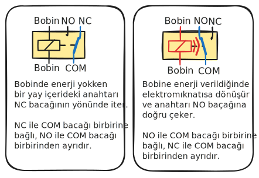

# Proje 09 - Termostat

## Giriş

Bu projede DHT20 sensörü kullanarak çevredeki sıcaklık ve nem değerlerini ölçeceğiz. Ölçtüğümüz verileri LCD ekranda gösterecek ve potansiyometre ile ayarladığın hedef sıcaklığa göre röle kontrol eden kendi dijital termostatımızı yapacağız. Bu proje, gerçek zamanlı sensör verilerini okuma ve otomatik kontrol sistemleri konusunda tecrübe kazanmanı sağlayacak.

## Yeni Kavramlar

### DHT20 Sensörü
**DHT20 sensörü**, hem sıcaklık hem de nem ölçümü yapabilen dijital bir sensördür. Analog sensörlerin aksine, ölçtüğü değerleri doğrudan sayısal forma çevirerek I2C protokolü üzerinden gönderir. Sensörün içinde mikroişlemci bulunur ve kalibre edilmiş hassas ölçümler sağlar. Ev termostatları, hava durumu istasyonları ve sera kontrolü gibi uygulamalarda yaygın olarak kullanılır. Kitin sol yakın köseşinde Sıcaklık/Nem sensörü olarak işaretlenmiş alanda bulunur.

### Röle (Relay)
**Röle**, küçük bir elektrik sinyali ile büyük güçlü cihazları açıp kapatmaya yarar. Arduino'nun çıkışları sadece 5V ve maksimum 20mA akım verebilir. Bunun anca bir LED'i yakabilirsiniz. Ama ya büyük bir motoru döndürmek veya bir ısıtıcıyı çalıştırmak istiyorsanız? Röle bu sorunu çözer: Arduino'dan gelen küçük sinyal ile 220V'luk ev cihazlarını bile kontrol edebilirsin.



Günlük hayatta röleleri her yerde görürsün: buzdolabının kompresörü, klimanın fanı, çamaşır makinesinin motoru - hepsi röle ile kontrol edilir. Kitin sağ alt köşesinde "Relay" olarak işaretlenmiş alanda bulunur.

### Termostat Mantığı
**Termostat**, belirlenen hedef sıcaklığı korumak için ısıtma veya soğutma sistemlerini otomatik olarak açıp kapatan akıllı kontrol sistemidir. Ev klimalarından buzdolaplarına, fırınlardan sera kontrolüne kadar her yerde kullanılır. 

**Histeresis** kavramı çok önemlidir. Isıtıcı ve soğutucu sistemlerin çoğu çok hızlı açıp kapamaya gelmez. Bu yüzden tek bir sıcaklık değerini cihazı hem açıp hem kapamak için kullanamayız. Böyle bir durumda hedef sıcaklığı ne seçersek seçelim sistem hedef sıcaklığa geldiğinde hızla açılıp kapanmaya başlar çünkü. Mesela fırının şu anki sıcaklığı 29C ve biz de 30C'ye getirmek istiyoruz diyelim. 30C'ye gelene kadar ısıtıcı çalışacak. 30C'ye gelir gelmez de kapanacak. Ama tabii ısıtıcı kapandığında sıcaklık da hemen düşmeye başlayacak ve ısıtıcı tekrar geri açılacak. E bu sefer de ısıtıcı açıldığında sıcaklık hızla 30C'nin üzerinde çıkacak ve ısıtıcı kapanacak. Bu döngü ısıtıcının çok hızlı bir şekilde açılıp kapanmasına sebep olacak ve ömrünü azaltacak. Ayrıca sadece ısıtıcının kendisinin değil, ona enerji aktaran röle'nin de bir açılıp kapanma ömrü var. Ondan da yiyoruz böyle yaparsak.

Bunun önüne geçmek için histeresis denen bir tolerans payı (örneğimizde 0.2°C) kullanılır. Böylece sistem kendini tam belirli bir sıcaklıkta değil de bir sıcaklık aralığında tutmaya çalışır. Böylece bu kadar sık açılıp kapanması gerekmez.


### Mantıksal Operatörler (&&)
**&& operatörü** "VE" anlamına gelir ve iki koşulun da doğru olmasını kontrol eder. `if (!role_durum && sicaklik > hedef_sicaklik)` ifadesi "eğer röle kapalı VE sıcaklık hedefin üstünde ise" anlamına gelir. Her iki koşul da doğruysa kod bloğu çalışır. 

### float Veri Tipi
**float**, ondalıklı sayıları saklamak için kullanılan veri tipidir. `int` sadece tam sayıları (1, 5, 100) saklarken, `float` ondalıklı değerleri (25.6, 0.2, 3.14) saklayabilir. Kullandığımız sensör 1 derecenin altında sıcaklık değişimlerini de ölçebildiği için bize float cinsinden bir değer veriyor. 


## Elektronik

**DHT20 Sensörü**: Bu sensör hem sıcaklık hem de nem ölçümü yapabilen dijital bir sensör. I2C protokolüyle Arduino'ya bağlanır ve hassas ölçümler sağlar. 

**I2C Bağlantısı**: DHT20 sensörü I2C protokolüyle çalışır. Bu protokol sadece 2 hat kullanır:
- **SDA (Serial Data)**: Veri hattı - Arduino'nun A4 pinine bağlı
- **SCL (Serial Clock)**: Saat sinyali hattı - Arduino'nun A5 pinine bağlı

**LCD Ekran**: Önceki projelerde de kullandığımız I2C LCD ekran. Sensör verileri bu ekranda görüntülenecek.

**Röle**: Röle D4 pinine bağlıdır. Arduino'dan digitalWrite(4, HIGH) komutu gönderildiğinde röle aktif olur ve bağlı cihazı (ısıtıcı veya soğutucu) çalıştırır. digitalWrite(4, LOW) komutu ile röle devre dışı kalır ve cihaz durur. 

Tabii biz bu projede gerçekten bir ısıtıcı ya da soğutucu bağlamayacağız. Ama yine de rölenin devreye girdiğinde ve devreden çıktığında çıkarttığı "tık" sesini duyabilirsin.  

I2C'nin avantajı, birden fazla cihazın aynı 2 hat üzerinde farklı adreslerle çalışabilmesidir. DHT20 sensörü ve LCD ekran aynı I2C hattını paylaşır ama farklı adreslere sahiptir.

## Kod

!!! note "Kütüphane kurulumu gerekli"
    Bu projenin çalışması için bazı kütüphanelerin kurulmuş olması  gerektiriyor. Detaylı kütüphane kurulum talimatları için [Kütüphane kurma](kutuphane-kurma.md) sayfasına bakabilirsin.

Bu proje için gerekli kütüphaneler:

- **Adafruit LiquidCrystal Attiny85**
- **DHT20 Rob Tillaart**

``` c
// Gerekli kütüphaneleri dahil ediyoruz
#include <DHT20.h>                    // DHT20 sensörü için kütüphane
#include <Adafruit_LiquidCrystal.h>   // LCD ekran için kütüphane

// LCD ekranımızı tanımlıyoruz (0x21 adresinde)
Adafruit_LiquidCrystal lcd(0x21);

// DHT20 sensörümüzü tanımlıyoruz
DHT20 DHT;

// Pin tanımları
const int POT_PIN = 0;        // Potansiyometre pini (hedef sıcaklık ayarı için)
const int ROLE_PIN = 4;       // Röle kontrol pini - Bu projede ilk kez röle kullanıyoruz!
                              // Röle büyük güçlü cihazları (ısıtıcı/soğutucu) kontrol eder
const int LED_PIN = 10;       // LED pini (sistem durumu göstergesi)

// Termostat modları
const int MOD_SOGUTMA = 0;    // Soğutma modu (sıcaklık hedefin üstünde ise çalışır)
const int MOD_ISITMA = 1;     // Isıtma modu (sıcaklık hedefin altında ise çalışır)

// Sıcaklık limitleri
const int MIN_SICAKLIK = 10;  // En düşük hedef sıcaklık
const int MAX_SICAKLIK = 35;  // En yüksek hedef sıcaklık
const float HISTERESIS = 0.2; // Titreşimi önlemek için tolerans değeri

// Termostat değişkenleri
float hedef_sicaklik = 0.0;   // Potansiyometreden okunan hedef sıcaklık

bool role_durum = LOW;        // Röle durumu (HIGH=açık, LOW=kapalı)
int mod = MOD_SOGUTMA;        // Şu anki çalışma modu (soğutma/ısıtma)

void setup() {
  // Program başladığında bir kere çalışan fonksiyon
  pinMode(ROLE_PIN,OUTPUT);
  pinMode(LED_PIN,OUTPUT);
  // LCD ekranı başlatıyoruz (16 karakter, 2 satır)
  lcd.begin(16, 2);
  
  // I2C haberleşmesini başlatıyoruz (sensör ile iletişim için)
  Wire.begin();
  
  // DHT20 sensörünü başlatıyoruz
  DHT.begin();

  Serial.begin(115200);
}


void loop() {
  // Bu fonksiyon sürekli tekrar eder - termostat ana döngüsü
  
  // 1. Potansiyometreden hedef sıcaklığı oku
  hedef_deger_ayarlama();
  
  // 2. Sensörden mevcut sıcaklık ve nem verisini al
  int status = DHT.read();
  float sicaklik = DHT.getTemperature();
  
  // 3. Termostat kontrolü - gerekirse röleyi aç/kapat
  sicaklik_kontrol(sicaklik);
  
  // 4. LCD ekranda verileri göster
  ekran_guncelleme(sicaklik);

  delay(100);  // 100ms bekle, sonra döngüyü tekrarla
}

void ekran_guncelleme(float sicaklik) {
  lcd.home();  // Sol üst köşeye git
  
  // İlk satır: Mevcut sıcaklık ve hedef sıcaklık
  lcd.print(sicaklik);        // Mevcut sıcaklık
  lcd.print("C   ");          // Santigrat simgesi
  lcd.print(hedef_sicaklik);  // Hedef sıcaklık
  lcd.print("C");
  
  // İkinci satır: Nem değeri
  lcd.setCursor(0,1);
  lcd.print("Nem: %");
  lcd.print(DHT.getHumidity());
}

// Termostat kontrol fonksiyonu - sıcaklığa göre röleyi aç/kapat
void sicaklik_kontrol(float sicaklik) {

  switch (mod) {
    case MOD_SOGUTMA:
      // Soğutma modu: sıcak olunca soğutucu çalışır
      if (!role_durum && sicaklik>hedef_sicaklik) {
        role_kontrol(HIGH);  // Soğutucu aç
      } else if (role_durum && sicaklik<hedef_sicaklik-HISTERESIS) {
        role_kontrol(LOW);   // Soğutucu kapat (hysteresis ile)
      }
      break;
    case MOD_ISITMA:
      // Isıtma modu: soğuk olunca ısıtıcı çalışır  
      if (!role_durum && sicaklik<hedef_sicaklik) {
        role_kontrol(HIGH);  // Isıtıcı aç
      } else if (role_durum && sicaklik>hedef_sicaklik+HISTERESIS) {
        role_kontrol(LOW);   // Isıtıcı kapat (hysteresis ile)
      }
      break;
  }
}

// Röle ve LED kontrol fonksiyonu
void role_kontrol(bool yeni_durum) {
  role_durum = yeni_durum;           // Durumu kaydet
  digitalWrite(ROLE_PIN,yeni_durum); // Röleyi aç/kapat (ısıtıcı/soğutucu)
  digitalWrite(LED_PIN,yeni_durum);  // LED ile durumu göster
}

// Potansiyometre ile hedef sıcaklık ayarlama fonksiyonu
void hedef_deger_ayarlama() {
  int pot_deger = analogRead(POT_PIN);  // Potansiyometre değerini oku (0-1023)
  // 0-1023 aralığını MIN-MAX sıcaklık aralığına çevir (10 ile çarp/böl = ondalık hassasiyet)
  float yeni_hedef = map(pot_deger,0,1023,MIN_SICAKLIK*10,MAX_SICAKLIK*10)/10.0;
  if (yeni_hedef != hedef_sicaklik) {
    hedef_sicaklik = yeni_hedef;        // Yeni hedef sıcaklığı kaydet
  }
}
```

--8<-- "snippets/yukleme.md"

Kod çalıştığında LCD ekranında anlık sıcaklık ve nem değerlerini ve hedef sıcaklığı göreceksin. Potansiyometreyi kullanarak hedef sıcaklığı ayarlayabilirsin.

Hedef sıcaklığı dış ortam sıcaklığının altında bir noktaya ayarladığında rölenin devreye girdiğini duyacak ve LED'in yandığını göreceksin. Üzerine çıkarttığında ise LED sönecek ve röle devreden çıkacak.

Potansiyometreyi çok yavaş hareket ettirerek hedef sıcaklıgı tam da dış ortam sıcaklığında rölenin devrede olmadığı en sınır değere ayarlarsan, sol yakın kösedeki DHT20 sensörüne hohlayarak termostatı devreye sokabilir, uzaktan üfleyerek de devreden çıkarabilirsin.


--8<-- "snippets/sorun-giderme.md"

Bu projede DHT20 sıcaklık/nem sensörünü kullanmayı, terostatların nasıl çalıştığını ve röleleri öğrendin. Aşağıdaki egzersizleri yapabilir misin?

1. Kitteki butona basıldığında sistemin soğutma ve ısıtma modları arasında geçiş yapmasını sağlayabilir misin?

2. Röleyi sıcaklık ile değil de nem oranıyla kontrol edebilir misin? Potansiyometre ile bir nem oranı ayarlanmalı ve o oranın üzerine çıkıldığında röle devreye girmeli
