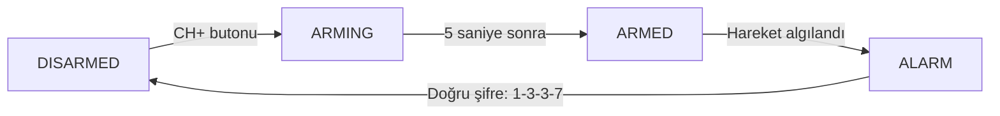

# Proje 12 - Akıllı Alarm Sistemi

## Giriş

Bu projede gerçek bir güvenlik sistemini andıran gelişmiş bir **Akıllı Alarm Sistemi** yapacaksın! Bu sistem PIR hareket sensörü, LED durum göstergesi, buzzer alarm ve IR kumanda kullanarak tam işlevli bir güvenlik çözümü sunuyor.

Sistem nasıl çalışır:
- **CH+** butonu ile sistem devreye alınır (5 saniye geri sayım)
- Sistem devredeyken hareket algılandığında 5 saniye uyarı süresi başlar
- Uyarı süresi sonunda sürekli alarm çalar
- **1-3-3-7** şifresi girilerek alarm kapatılır
- LED ile sistem durumu sürekli gösterilir

Bu projede öğreneceklerin:
- **State Machine** (Durum Makinesi) programlama
- PIR hareket sensörü kullanımı
- IR kumanda ile şifre sistemi
- **LCD ekran entegrasyonu** ve gerçek zamanlı görüntüleme
- Non-blocking zamanlayıcı teknikleri
- Güvenlik sistemi mantığı ve algoritmaları

## Elektronik

Akıllı Alarm Sistemi devresinde beş ana bileşen bulunuyor:

### PIR Hareket Sensörü (Analog Pin A2)
PIR (Passive Infrared) sensörü, insanların vücut ısısından çıkan kızılötesi radyasyonu algılar. Sensör hareket algıladığında çıkışı HIGH (5V) olur, hareket olmadığında LOW (0V) kalır. Sensörün algılama menzili yaklaşık 3-5 metre ve 120° açıdır.

### Durum LED'i (Digital Pin D10)  
Sistem durumunu gösteren LED farklı yanıp sönme desenleriyle bilgi verir:
- **Kapalı**: Sistem devre dışı
- **Yavaş yanıp sönme**: Sistem devreye alınıyor
- **Sürekli yanık**: Sistem devrede ve bekliyor
- **Hızlı yanıp sönme**: Alarm durumu

### Buzzer (Digital Pin D3)
PWM destekli pin kullanarak farklı frekanslarda sesler çıkarır. Geri sayım, uyarı ve alarm sesleri için kullanılır.

### IR Alıcı Modülü (Digital Pin D2)
Kit ile birlikte gelen IR kumandadan gelen sinyalleri alır. CH+ butonu sistem kontrolü, sayı butonları (1,3,7) şifre girişi için kullanılır.

### LCD Ekran (I²C Adresi 0x21)
16x2 karakterlik LCD ekran, I²C protokolü üzerinden MCP23008 expander ile kontrol edilir. Sistem durumunu, geri sayımları ve kullanıcı mesajlarını gerçek zamanlı olarak gösterir:
- **Satır 1**: Sistem durumu ve ana bilgiler
- **Satır 2**: Detaylı durumlar, geri sayımlar ve şifre girişi
- Alarm durumunda yanıp sönen uyarı metinleri ile görsel alarm etkisi

**Bağlantı Bilgileri:**
- **VCC**: 5V (Arduino'nun 5V pinine)
- **GND**: Toprak (Arduino'nun GND pinine)  
- **SDA**: A4 pinine (Arduino Uno'da I²C veri hattı)
- **SCL**: A5 pinine (Arduino Uno'da I²C saat hattı)


## Kod

```c
/*
Bu projede gelişmiş bir alarm sistemi yapacaksin. Sistem PIR hareket sensörü, LED, 
buzzer ve IR kumanda kullanarak tam işlevli bir güvenlik sistemi oluşturuyor.

Sistem Özellikleri:
- CH+ butonu ile sistem devreye alınır (5 saniye geri sayım)
- Hareket algılandığında 5 saniye uyarı süresi
- 4 haneli kod (1-3-3-7) ile sistem kapatılır
- LED ile sistem durumu gösterimi
- Non-blocking kod yapisi ile smooth çalişma

Öğreneceklerin:
- State machine (durum makinesi) programlama
- PIR hareket sensörü kullanımı
- IR kumanda entegrasyonu
- Zamanlayıcı tabanlı non-blocking kod
- Güvenlik sistemi mantığı
*/

#include <IRremote.hpp>
#include <Adafruit_LiquidCrystal.h>   // LCD ekran için kütüphane

/*******************Pin Tanımlamaları*******************/
const int PIR_PIN = A2;           // PIR hareket sensörü pin (Analog A2)
const int LED_PIN = 10;           // Durum LED'i pin (Digital 10) 
const int BUZZER_PIN = 3;         // Buzzer pin (PWM destekli pin 3)
const int IR_RECV_PIN = 2;        // IR alıcı pin (Digital 2)
const int LCD_I2C_ADDR = 0x21;    // LCD I2C adresi

/*******************IR Kumanda Kodları*******************/
// IR kumanda buton kodları (kumanda-kodlari.md'den alındı)
#define BUTTON_CH_PLUS     0x47   // CH+ butonu - sistemi devreye al
#define BUTTON_1           0x0C   // Şifre hanesi 1
#define BUTTON_2           0x18   // Şifre hanesi 2  
#define BUTTON_3           0x5E   // Şifre hanesi 3
#define BUTTON_4           0x08   // Şifre hanesi 4
#define BUTTON_7           0x42   // Şifre hanesi 7

/*******************Sistem Durumları*******************/
enum AlarmState {
  DISARMED,    // Sistem kapalı
  ARMING,      // Sistem devreye alınıyor (5 saniye geri sayım)
  ARMED,       // Sistem devrede ve bekliyor
  ALARM        // Alarm çalıyor
};

AlarmState currentState = DISARMED;    // Başlangıç durumu: sistem kapalı

/*******************Zamanlayıcı Değişkenleri*******************/
unsigned long stateChangeTime = 0;    // Durum değişiklik zamanı
unsigned long lastBeepTime = 0;       // Son bip zamanı  
unsigned long lastLedTime = 0;        // LED yanıp sönme zamanı
int beepCount = 0;                    // Bip sayacı
bool ledState = false;                // LED durumu (yanıp sönme için)

/*******************Şifre Sistemi*******************/
const int CODE_LENGTH = 4;            // Şifre uzunluğu
int secretCode[CODE_LENGTH] = {1, 3, 3, 7};  // Gizli kod: 1-3-3-7 sırası
int enteredCode[CODE_LENGTH];         // Girilen kod dizisi
int codePosition = 0;                 // Kod girişinde hangi pozisyondayız

/*******************PIR Sensör Değişkenleri*******************/
bool motionDetected = false;          // Hareket algılandı mı?
unsigned long motionTime = 0;         // Hareket algılandığı zaman
bool pirState = LOW;                  // PIR sensör durumu

/*******************LCD Ekran*******************/
Adafruit_LiquidCrystal lcd(LCD_I2C_ADDR);  // LCD nesnesi (I2C adresi 0x21)


void setup() {
  /*
  Serial haberleşmeyi yüksek hızda başlatıyoruz (115200 baud).
  Bu alarm sisteminin durumunu ve debug bilgilerini görmek için kullanılacak.
  */
  Serial.begin(115200);
  while (!Serial);  // Serial monitor bağlantısını bekle

  /*
  Pin konfigürasyonları:
  - PIR sensör: INPUT - hareket algılama için
  - LED: OUTPUT - durum göstergesi için  
  - Buzzer: OUTPUT - alarm sesleri için
  IR alıcı pinini kütüphane otomatik olarak yapılandıracak.
  */
  pinMode(PIR_PIN, INPUT);
  pinMode(LED_PIN, OUTPUT);
  pinMode(BUZZER_PIN, OUTPUT);

  /*
  IR alıcıyı başlatıyoruz. ENABLE_LED_FEEDBACK parametresi Arduino'nun
  üzerindeki LED'in IR sinyali geldiğinde yanmasını sağlar.
  */
  IrReceiver.begin(IR_RECV_PIN, ENABLE_LED_FEEDBACK);

  /*
  LCD ekranı başlatıyoruz (16x2). I2C protokolü üzerinden MCP23008 
  expander ile iletişim kurar. LCD sistem durumunu ve mesajları 
  göstermek için kullanılacak.
  */
  lcd.begin(16, 2);
  lcd.clear();  // Ekranı temizle

  /*
  Başlangıçta tüm çıkışları kapatıyoruz.
  LED'i kapatır, buzzer'ı susturur ve sistem durumunu hazırlar.
  */
  digitalWrite(LED_PIN, LOW);
  noTone(BUZZER_PIN);
  
  Serial.println("=== AKILLI GÜVENLİK SİSTEMİ ===");
  Serial.println("CH+ butonu ile sistemi devreye alın");
  Serial.println("Şifre: 1-3-3-7 (sırayla basın)");
  Serial.println("===============================");

  /*
  LCD ekranında başlangıç mesajı göster
  */
  lcd.setCursor(0, 0);
  lcd.print("ALARM SISTEMI");
  lcd.setCursor(0, 1);
  lcd.print("Hazir...");
  delay(2000);  // 2 saniye göster
  
  printSystemStatus();
}

void loop() {
  /*
  Ana döngüde üç ana işlemi yapıyoruz:
  1. IR kumanda sinyallerini kontrol et
  2. PIR sensörden hareket kontrolü yap
  3. Sistem durumuna göre gerekli işlemleri gerçekleştir
  
  ÖNEMLI: delay() kullanmıyoruz! Bunun yerine millis() tabanlı
  zamanlayıcılar kullanarak non-blocking kod yazıyoruz.
  */
  
  // IR kumanda kontrolü
  handleIRRemote();
  
  // PIR sensör kontrolü
  handleMotionSensor();
  
  // Sistem durum makinesi
  handleStateMachine();
  
  // LED yanıp sönme kontrolleri
  updateStatusLED();
  
  
  // Kısa gecikme (CPU yükünü azaltmak için)
  delay(10);
}

/*
IR kumanda sinyallerini işleyen fonksiyon.
Gelen buton kodlarını kontrol eder ve uygun işlemleri yapar.
*/
void handleIRRemote() {
  if (IrReceiver.decode()) {
    uint32_t buttonCode = IrReceiver.decodedIRData.decodedRawData;
    
    Serial.print("IR Buton: 0x");
    Serial.println(buttonCode, HEX);
    
    // CH+ butonu - sistem devreye alma
    if (buttonCode == BUTTON_CH_PLUS && currentState == DISARMED) {
      startArming();
    }
    // Şifre butonları (1, 3, 7)
    else if (currentState == ALARM) {
      handlePasswordInput(buttonCode);
    }
    
    IrReceiver.resume();  // Bir sonraki sinyali almaya hazırlan
    delay(250);           // Buton bounce'unu engellemek için gecikme
  }
}

/*
PIR hareket sensörünü kontrol eden fonksiyon.
Hareket algılandığında sistem durumuna göre uygun tepkiyi verir.
*/
void handleMotionSensor() {
  int pirReading = digitalRead(PIR_PIN);
  
  /*
  PIR sensör çıkışı:
  - HIGH (1): Hareket algılandı
  - LOW (0): Hareket yok
  
  Sensör hareket algıladığında birkaç saniye HIGH kalır,
  sonra otomatik olarak LOW'a döner.
  */
  
  // Yeni hareket algılandı
  if (pirReading == HIGH && pirState == LOW) {
    pirState = HIGH;
    motionTime = millis();
    
    if (currentState == ARMED) {
      Serial.println("HAREKET ALGILANDI! Uyarı süresi başladı...");
      startAlarm();
    }
  }
  
  // Hareket sona erdi  
  if (pirReading == LOW && pirState == HIGH) {
    pirState = LOW;
    Serial.println("Hareket sona erdi");
  }
}

/*
Ana durum makinesi fonksiyonu. Sistem durumuna göre gerekli işlemleri yapar.
Bu fonksiyon sürekli çalışır ve zamanlayıcıları kontrol eder.
*/
void handleStateMachine() {
  unsigned long currentTime = millis();
  
  switch (currentState) {
    case DISARMED:
      // Sistem kapalı - sadece CH+ butonunu bekle
      break;
      
    case ARMING:
      /*
      Sistem devreye alınıyor. 5 saniye boyunca her saniye bir bip çıkar.
      5 saniye sonra ARMED durumuna geç.
      */
      if (currentTime - stateChangeTime < 5000) {  // 5 saniye = 5000 ms
        // Her saniye bir bip çıkar
        if (currentTime - lastBeepTime >= 1000 && beepCount < 5) {
          playBeep(500, 100);  // Kısa bip sesi
          beepCount++;
          lastBeepTime = currentTime;
          Serial.print("Geri sayım: ");
          Serial.println(6 - beepCount);
        }
      } else {
        // 5 saniye doldu - sistem devrede
        Serial.println("SİSTEM DEVREye ALINDI!");
        playBeep(1000, 300);  // Uzun onay bip'i
        changeState(ARMED);
      }
      break;
      
    case ARMED:
      /*
      Sistem devrede ve hareket bekliyor. 
      PIR sensör tarafından hareket algılandığında ALARM durumuna geçer.
      */
      // Sistem devrede - PIR sensör kontrolü handleMotionSensor() ile yapılıyor
      break;
      
    case ALARM:
      /*
      Alarm durumu. Hareket algılandıktan 5 saniye sonra sürekli alarm çalar.
      Doğru şifre girilene kadar devam eder.
      */
      if (currentTime - stateChangeTime < 5000) {
        // İlk 5 saniye uyarı süresi - yavaş bip'ler
        if (currentTime - lastBeepTime >= 500) {  // Her 500ms'de bir bip
          playBeep(800, 100);
          lastBeepTime = currentTime;
          Serial.println("UYARI! 5 saniye içinde şifre girin!");
        }
      } else {
        // 5 saniye doldu - sürekli alarm
        if (currentTime - lastBeepTime >= 200) {  // Hızlı bip'ler
          playBeep(1500, 100);
          lastBeepTime = currentTime;
          Serial.println("ALARM! Şifre: 1-3-3-7");
        }
      }
      break;
  }
}

/*
LED durum göstergesi fonksiyonu. Sistem durumuna göre LED'i kontrol eder.
- DISARMED: LED kapalı
- ARMING: Yavaş yanıp sönme
- ARMED: Sürekli yanık  
- ALARM: Hızlı yanıp sönme
*/
void updateStatusLED() {
  unsigned long currentTime = millis();
  
  switch (currentState) {
    case DISARMED:
      digitalWrite(LED_PIN, LOW);  // LED kapalı
      break;
      
    case ARMING:
      // Yavaş yanıp sönme (500ms aralık)
      if (currentTime - lastLedTime >= 500) {
        ledState = !ledState;
        digitalWrite(LED_PIN, ledState);
        lastLedTime = currentTime;
      }
      break;
      
    case ARMED:
      digitalWrite(LED_PIN, HIGH);  // LED sürekli yanık
      break;
      
    case ALARM:
      // Hızlı yanıp sönme (100ms aralık)  
      if (currentTime - lastLedTime >= 100) {
        ledState = !ledState;
        digitalWrite(LED_PIN, ledState);
        lastLedTime = currentTime;
      }
      break;
  }
}

/*
Tüm durum değişikliklerini merkezi olarak yöneten fonksiyon.
Durum değiştiğinde LCD ve serial çıkışları günceller.
*/
void changeState(AlarmState newState) {
  currentState = newState;
  stateChangeTime = millis();
  
  // Duruma özel başlangıç işlemleri
  switch (newState) {
    case ARMING:
      beepCount = 0;
      lastBeepTime = 0;
      break;
    case ALARM:
      codePosition = 0;
      for (int i = 0; i < CODE_LENGTH; i++) {
        enteredCode[i] = 0;
      }
      break;
  }
  
  printSystemStatus();
  updateLCD();
}

/*
Sistem devreye alma işlemini başlatan fonksiyon.
ARMING durumuna geçer ve zamanlayıcıları sıfırlar.
*/
void startArming() {
  Serial.println("Sistem devreye alınıyor... 5 saniye!");
  changeState(ARMING);
}

/*
Alarm durumunu başlatan fonksiyon.
Hareket algılandığında çağrılır.
*/
void startAlarm() {
  Serial.println("ALARM DURUMU! Uyarı süresi başladı!");
  changeState(ALARM);
}

/*
Şifre girişini işleyen fonksiyon.
IR kumandadan gelen sayı butonlarını kontrol eder.
*/
void handlePasswordInput(uint32_t buttonCode) {
  int digit = -1;
  
  // Buton kodunu sayıya çevir
  switch (buttonCode) {
    case BUTTON_1: digit = 1; break;
    case BUTTON_2: digit = 2; break;  
    case BUTTON_3: digit = 3; break;
    case BUTTON_4: digit = 4; break;
    case BUTTON_7: digit = 7; break;
    default:
      Serial.println("Geçersiz tuş! Şifre: 1-3-3-7");
      return;
  }
  
  // Şifreyi kontrol et
  if (codePosition < CODE_LENGTH) {
    enteredCode[codePosition] = digit;
    codePosition++;
    
    Serial.print("Şifre hanesi girildi: ");
    Serial.print(digit);
    Serial.print(" (");
    Serial.print(codePosition);
    Serial.print("/");
    Serial.print(CODE_LENGTH);
    Serial.println(")");
    
    playBeep(600, 50);  // Kısa onay bip'i
    
    // LCD'de şifre girişi güncelle
    updateLCDPasswordEntry();
    
    // Şifre tamam mı kontrol et
    if (codePosition == CODE_LENGTH) {
      checkPassword();
    }
  }
}

/*
Girilen şifreyi kontrol eden fonksiyon.
Şifre doğruysa sistemi kapatır, yanlışsa sıfırlar.
*/
void checkPassword() {
  bool codeCorrect = true;
  
  // Girilen kodu gizli kod ile karşılaştır
  for (int i = 0; i < CODE_LENGTH; i++) {
    if (enteredCode[i] != secretCode[i]) {
      codeCorrect = false;
      break;
    }
  }
  
  if (codeCorrect) {
    Serial.println("ŞİFRE DOĞRU! Sistem kapatıldı.");
    
    // LCD'de başarı mesajı göster
    lcd.clear();
    lcd.setCursor(0, 0);
    lcd.print("KOD DOGRU!");
    lcd.setCursor(0, 1);
    lcd.print("Sistem kapatildi");
    
    // Başarı melodisi çal
    playBeep(800, 100);
    delay(100);
    playBeep(1000, 100);
    delay(100);
    playBeep(1200, 200);
    
    delay(2000);  // Mesajı 2 saniye göster
    
    // Şifre doğru - sistemi kapat
    changeState(DISARMED);
  } else {
    // Şifre yanlış - tekrar dene
    codePosition = 0;
    
    // Girilen kodu sıfırla
    for (int i = 0; i < CODE_LENGTH; i++) {
      enteredCode[i] = 0;
    }
    
    Serial.println("YANLIŞ ŞİFRE! Tekrar deneyin: 1-3-3-7");
    
    // LCD'de hata mesajı göster
    lcd.clear();
    lcd.setCursor(0, 0);
    lcd.print("YANLIS KOD!");
    lcd.setCursor(0, 1);
    lcd.print("Tekrar deneyin");
    
    // Hata sesi çal
    playBeep(300, 500);
    
    delay(1500);  // Hata mesajını 1.5 saniye göster
    updateLCD();  // Normal alarm ekranına dön
  }
}

/*
Buzzer ile ses çıkaran fonksiyon.
Belirtilen frekansta ve sürede ses çıkarır.
*/
void playBeep(int frequency, int duration) {
  tone(BUZZER_PIN, frequency, duration);
  /*
  tone() fonksiyonu:
  1. Pin: Buzzer'ın bağlı olduğu pin
  2. Frekans: Sesin perdesi (Hz cinsinden)  
  3. Süre: Sesin çalma süresi (milisaniye)
  
  Non-blocking olarak çalışır, yani ses çalarken kod devam eder.
  */
}

/*
Sistem durumunu Serial Monitor'e yazdıran yardımcı fonksiyon.
Debug ve kullanıcı bilgisi için kullanılır.
*/
void printSystemStatus() {
  Serial.print("Sistem Durumu: ");
  
  switch (currentState) {
    case DISARMED:
      Serial.println("KAPALI");
      Serial.println("CH+ ile sistemi devreye alın");
      break;
    case ARMING:
      Serial.println("DEVREYE ALINIYOR");
      Serial.println("Geri sayım başladı...");
      break;
    case ARMED:
      Serial.println("DEVREye ALINDI");
      Serial.println("Hareket bekleniyor...");
      break;
    case ALARM:
      Serial.println("ALARM!");
      Serial.println("Şifre girin: 1-3-3-7");
      break;
  }
  Serial.println("---");
}

/*
Basit LCD güncelleme fonksiyonu. Sadece durum değişikliklerinde çağrılır.
*/
void updateLCD() {
  displayCurrentState();
}

/*
ARMING durumunda geri sayımı güncelleyen fonksiyon.
*/
void updateLCDCountdown() {
  unsigned long currentTime = millis();
  lcd.setCursor(0, 1);
  lcd.print("Geri sayim: ");
  int remainingSeconds = 5 - ((currentTime - stateChangeTime) / 1000);
  if (remainingSeconds > 0) {
    lcd.print(remainingSeconds);
    lcd.print(" sn ");
  } else {
    lcd.print("0 sn ");
  }
}

/*
ALARM durumunda şifre girişi güncellemeyi yapan fonksiyon.
*/
void updateLCDPasswordEntry() {
  lcd.setCursor(0, 1);
  if (codePosition > 0) {
    lcd.print("Kod: ");
    for (int i = 0; i < codePosition; i++) {
      lcd.print("*");
    }
    for (int i = codePosition; i < CODE_LENGTH; i++) {
      lcd.print("-");
    }
    lcd.print("    ");  // Temizleme boşlukları
  } else {
    lcd.print("4 haneli sifre  ");
  }
}

/*
Mevcut sistem durumuna göre LCD ekranını günceller.
Durum değişikliklerinde çağrılır.
*/
void displayCurrentState() {
  lcd.clear();
  
  switch (currentState) {
    case DISARMED:
      lcd.setCursor(0, 0);
      lcd.print("Durum: KAPALI");
      lcd.setCursor(0, 1);
      lcd.print("CH+ ile baslatin");
      break;
      
    case ARMING:
      lcd.setCursor(0, 0);
      lcd.print("Devreye aliniyor");
      updateLCDCountdown();  // İlk geri sayım değerini göster
      break;
      
    case ARMED:
      lcd.setCursor(0, 0);
      lcd.print("Durum: AKTIF");
      lcd.setCursor(0, 1);
      lcd.print("Hareket bekliyor");
      break;
      
    case ALARM:
      lcd.setCursor(0, 0);
      lcd.print("*** ALARM! ***");
      updateLCDPasswordEntry();  // İlk şifre durumunu göster
      break;
  }
}
```

--8<-- "snippets/yukleme.md"

Kodu yükledikten sonra sistem durumunu hem **LCD ekranda** hem de Serial Monitor'de (115200 baud) izleyebilirsin. LCD ekranda gerçek zamanlı olarak:
- Sistem durumu (KAPALI/AKTIF/ALARM)
- Geri sayım zamanlayıcıları
- Şifre girişi ilerlemesi
- Hareket algılama uyarıları

İlk olarak CH+ butonu ile sistemi devreye al, sonra PIR sensörünün önünde hareket et ve alarm çalıştığında 1-3-3-7 şifresi ile sistemi kapat!

--8<-- "snippets/sorun-giderme.md"

## Sistem Durumları ve LED Göstergeleri

Bu alarm sistemi **State Machine** (Durum Makinesi) mantığıyla çalışır. Sistemin 4 farklı durumu vardır:

| Durum | LED Görünümü | LCD Ekran | Buzzer | Açıklama |
|-------|-------------|----------|---------|-----------|
| **DISARMED** | Kapalı | "Durum: KAPALI<br>CH+ ile baslatin" | Sessiz | Sistem kapalı, CH+ bekliyor |
| **ARMING** | Yavaş yanıp sönme | "Devreye aliniyor<br>Geri sayim: X sn" | 5 bip | 5 saniye geri sayım |
| **ARMED** | Sürekli yanık | "Durum: AKTIF<br>Hareket bekliyor" | Sessiz | Sistem aktif, hareket bekliyor |
| **ALARM** | Hızlı yanıp sönme | "*** ALARM! *** (yanıp sönme)<br>4 haneli sifre" | Sürekli alarm | Hareket algılandı, şifre bekliyor |

### Durum Geçişleri



Bu projede **non-blocking programlama** tekniği kullanılıyor. `delay()` fonksiyonu yerine `millis()` ile zamanlayıcılar kurulmuş, böylece Arduino aynı anda birden fazla işi yapabiliyor.

## LCD Ekran Entegrasyonu

LCD ekran, bu alarm sistemine önemli avantajlar katıyor:

### 1. **Bağımsız Çalışma**
Sistem artık bilgisayara bağlı olmadan da durum bilgilerini gösterebiliyor. LCD ekran sayesinde hangi durumda olduğunu, geri sayımları ve uyarıları görebilirsin.

### 2. **Gerçek Zamanlı Feedback**
- **Geri sayım gösterimi**: Sistem devreye alınırken kalan saniye
- **Şifre girişi**: Hangi hanelerin girildiği görsel olarak takip edilebiliyor
- **Alarm efekti**: Yanıp sönen "ALARM!" yazısı ile görsel uyarı

### 3. **Kullanıcı Dostu Arayüz**  
Serial Monitor'e kıyasla çok daha pratik ve anlaşılır. Her durum için optimize edilmiş mesajlar ve düzenli layout.

### 4. **LCD Flickering Optimizasyonu**
Bu projede LCD ekran **flickering** (yanıp sönme) problemini çözen gelişmiş teknikler kullanılıyor:

#### Problem: Sürekli `lcd.clear()` Kullanımı
Geleneksel yaklaşımda LCD her 10ms'de tamamen temizlenir ve yeniden çizilir:
```c
// KÖTÜ ÖRNEK - Flickering'e sebep olur
void updateLCD() {
  lcd.clear();  // Her çağrıda ekranı tamamen temizle
  // Tüm içeriği yeniden çiz
}
```

#### Çözüm: Akıllı Güncelleme Sistemi
1. **Durum Değişikliği Tespiti**: LCD sadece değişiklik olduğunda güncellenir
2. **Zamanlı Güncellemeler**: Dinamik içerik (geri sayım, yanıp sönme) kontrollü aralıklarla
3. **Seçici Temizleme**: `lcd.clear()` yerine boşluk karakterleri ile hedefli temizlik
4. **Performans**: CPU yükü azalır, pil ömrü artar

#### Teknik Detaylar
- **previousState**: Durum değişikliği tespiti için
- **lastLCDUpdate**: Güncelleme zamanlaması için  
- **previousCountdown/previousAlarmBlink**: Değişen içerik tespiti için
- **Boşluk karakterli temizleme**: Flickering'siz içerik değişikliği

## Güvenlik Sistemi Özellikleri

### 1. PIR Hareket Algılama
PIR sensörü **kızılötesi radyasyon** değişikliklerini algılar. İnsan vücudu yaklaşık 37°C sıcaklıkta kızılötesi ışın yayar ve sensör bu ışınlardaki değişimleri tespit eder.

### 2. Zamanlayıcı Tabanlı Kontrol  
Sistem tüm zamanlama işlemlerini `millis()` fonksiyonu ile yapar:
- **Devreye alma**: 5 saniye geri sayım
- **Uyarı süresi**: Hareket algılandıktan 5 saniye sonra alarm
- **LED yanıp sönme**: Farklı hızlarda yanıp sönme desenleri

### 3. Şifre Güvenlik Sistemi
4 haneli şifre sistemi (1-3-3-7) ile güvenlik sağlanır. Yanlış şifre girildiğinde sistem sıfırlanır ve tekrar deneme imkanı verir.

Bu proje ile durum makinesi programlama, PIR sensör kullanımı, IR kumanda entegrasyonu ve non-blocking kod yazma tekniklerini öğrenmiş oldun!

## Egzersizler

1. **Şifre Değişikliği**: Sistemi farklı bir 4 haneli şifre ile çalışacak şekilde değiştirebilir misin?[^1]

2. **Çoklu Uyarı**: Alarm çalmadan önce 3 kez uyarı bip'i çıkaran bir versiyon yapabilir misin?[^2]

3. **Otomatik Sıfırlama**: Alarm 30 saniye çaldıktan sonra otomatik olarak kapanan bir sistem yazabilir misin?[^3]

4. **LCD Menü Sistemi**: LCD ekranda gezinilebilir bir ayarlar menüsü yapabilir misin? (Şifre değiştirme, ses seviyesi ayarlama)[^4]

5. **Çoklu Sensör**: İki farklı PIR sensörü kullanarak farklı alanları koruyan bir sistem tasarlayabilir misin?[^5]

[^1]: `secretCode` dizisini değiştirmen ve ilgili IR buton kodlarını eklemen gerekecek.

[^2]: `startAlarm()` fonksiyonuna bir sayaç ekleyip alarm öncesi uyarı bip'leri çıkarabilirsin.

[^3]: `handleStateMachine()` içinde ALARM durumunda zaman kontrolü ekleyip 30 saniye sonra DISARMED'a geçebilirsin.

[^4]: IR kumandanın yukarı/aşağı butonları ile menüde gezinebilir ve ayarları değiştirebilirsin. EEPROM kullanarak ayarları kalıcı hale getirebilirsin.

[^5]: İki PIR sensör pinini okuyup, hangi sensörün hareket algıladığına göre farklı alarm sesleri çıkarabilirsin.