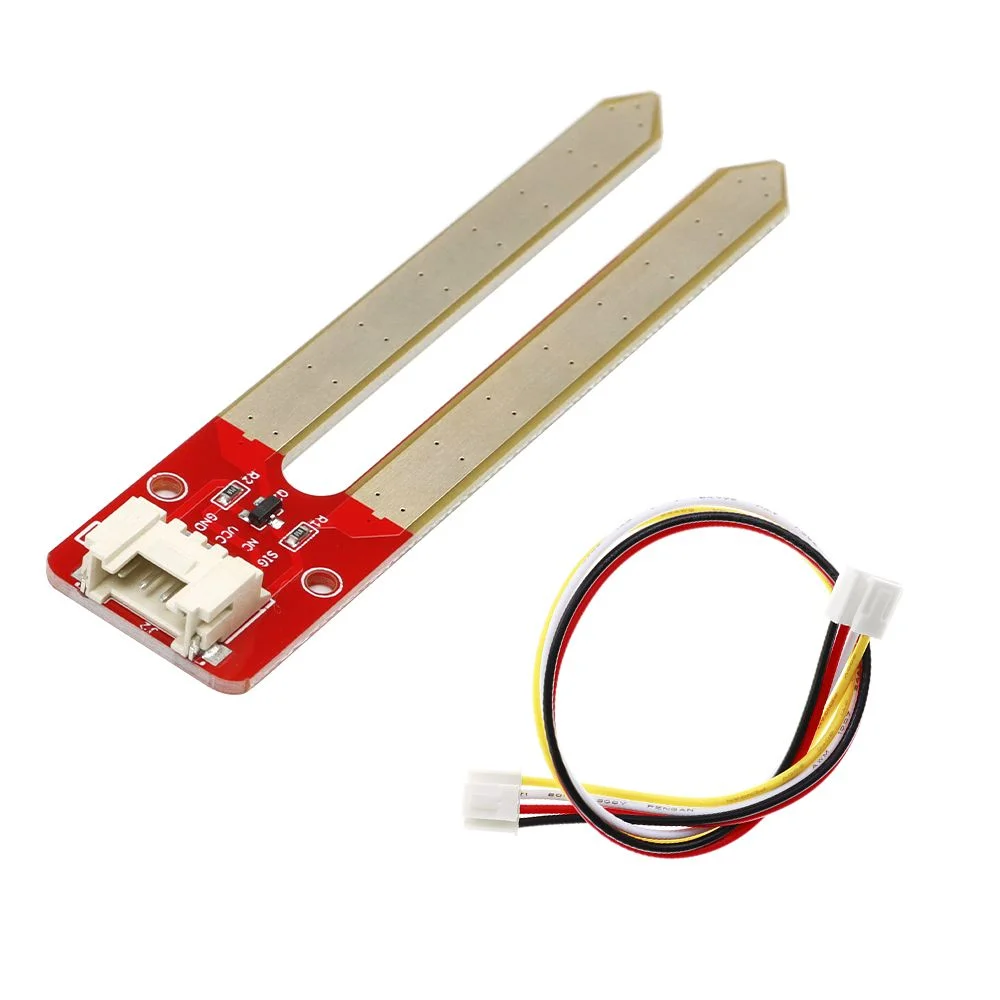
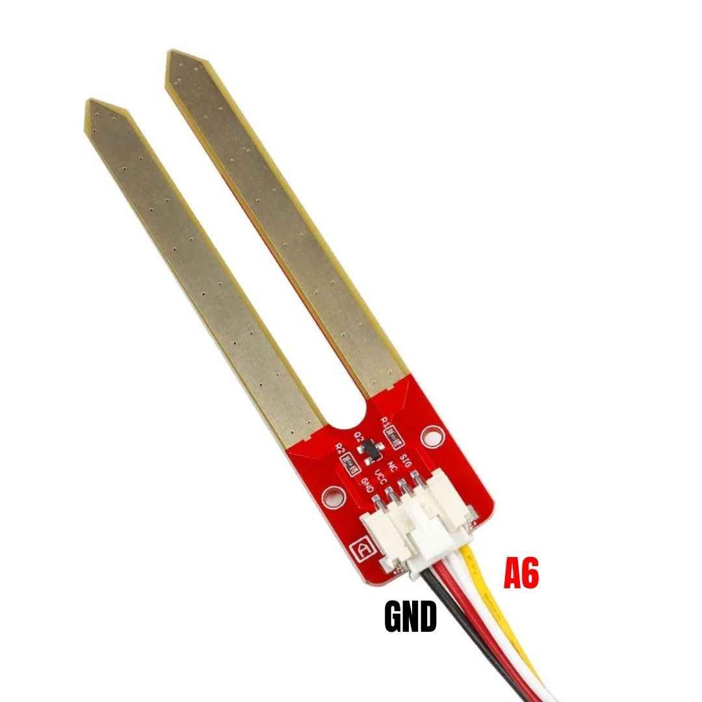

# Proje 13 - Bitki Takip Sistemi

## Giriş

Bitkilerin konuşamadığını kim söyledi? Bu projede **toprak nem sensörünü** kullanarak çiçeğinin ne zaman susadığını anlayacağız. Eğer toprak kurumuşsa sistem seni hem görsel hem de sesli olarak uyaracak. Ama merak etme; buzzer seni rahatsız etmemek için sadece 3 kez kısa kısa ötecek, LED ise sen çiçeği sulayana kadar sana hatırlatmak için yanık kalacak.

Bu projede öğreneceklerin:

- **Toprak nem sensörü** ile analog değer okuma
- **Bayrak (flag) değişkeni** ile tek seferlik uyarı sistemi
- **LCD ekran** ile gerçek zamanlı değer gösterimi
- Analog sensör verilerini mantıksal kararlara dönüştürme

## Elektronik

Bitki Takip Sistemi devresinde dört ana bileşen bulunuyor:

### Toprak Nem Sensörü (Analog Pin A6)

Toprak nem sensörü, toprağın içindeki su miktarını ölçen iki bacaktan oluşur. Su iletken olduğu için toprak ıslakken bacaklar arası direnç düşer, kurudukça direnç artar. Arduino bu değişimi `analogRead()` ile **0 ile 1023 arasında** bir sayı olarak okur.

!!! warning "Dikkat"
    Değer ne kadar **düşükse**, toprak o kadar **kuru** demektir. Bu sezgisel değil ama mantıklı: kuru toprakta direnç yüksek olduğu için az akım geçer, dolayısıyla sensör düşük değer okur.

### Kırmızı LED (Digital Pin D10)

Toprak kuruduğunda sürekli yanan görsel uyarı. Çiçeği suladığında otomatik söner.

### Buzzer (Digital Pin D3)

Toprak ilk kuruduğunda **3 kez** kısa bip sesi çıkarır. Sonrasında sessiz kalır — sürekli bip sesi yerine tek seferlik uyarı sistemi kullanıyoruz.

### LCD Ekran (I²C Adresi 0x21)

16x2 karakterlik LCD ekran, anlık nem değerini ve sistem durumunu gösterir:

- **1. satır**: Anlık nem sensörü değeri
- **2. satır**: "BENI SULA! :(" veya "DURUM: TAMAM :)"





## Kod

!!! note "Kütüphane kurulumu gerekli"
    Bu projenin çalışması için bazı kütüphanelerin kurulmuş olması gerekiyor. Detaylı kütüphane kurulum talimatları için [Kütüphane kurma](kutuphane-kurma.md) sayfasına bakabilirsin.

Bu proje için gerekli kütüphane:

- **Adafruit LiquidCrystal Attiny85**

```c
/*
Bu projede toprak nem sensörü kullanarak bitkinin ne zaman
sulanması gerektiğini anlayan bir sistem yapacaksın.

Sensörden gelen analog değeri eşik değeriyle karşılaştırıyoruz.
Toprak kuruduğunda LED yanar ve buzzer 3 kez öter.
Buzzer'ın sürekli ötmemesi için "bayrak" (flag) değişkeni kullanıyoruz.
*/

#include <Wire.h>
#include <Adafruit_LiquidCrystal.h>

Adafruit_LiquidCrystal lcd(0x21);

const int nemSensorPin = A6; // A6 pini
const int buzzerPin = 3;     //  3. pin
const int ledPin = 10;       //  10. pin

/*
Eşik değeri: Bu sayının altındaki nem değerlerini "kuru" sayacağız.
Sukulent veya Paşa Kılıcı gibi bitkiler için 300 genellikle uygundur.
Kendi bitkine göre bu değeri değiştirebilirsin.
*/
int esikDegeri = 300;

/*
Bayrak değişkeni: Buzzer'ın daha önce ötüp ötmediğini takip eder.
true  → buzzer zaten 3 kez öttü, bir daha çalma
false → buzzer henüz ötmedi, çalabilir
*/
bool uyariVerildi = false;

void setup() {
  pinMode(buzzerPin, OUTPUT);
  pinMode(ledPin, OUTPUT);

  lcd.begin(16, 2);
  lcd.setBacklight(HIGH);

  lcd.print("Cicek Takip");
  delay(2000);
  lcd.clear();
}

void loop() {
  int nemDegeri = analogRead(nemSensorPin);

  /*
  Ekranın ilk satırına anlık değeri yazalım.
  Sondaki boşluklar eski rakamların ekranda kalmasını önler.
  Örneğin değer 1000'den 99'a düştüğünde "99  " şeklinde temizlenir.
  */
  lcd.setCursor(0, 0);
  lcd.print("Nem Degeri: ");
  lcd.print(nemDegeri);
  lcd.print("   ");

  // Eğer toprak KURUYSA
  if (nemDegeri < esikDegeri) {
    digitalWrite(ledPin, HIGH); // LED yanık kalır

    lcd.setCursor(0, 1);
    lcd.print("BENI SULA! :(   ");

    /*
    Bayrak kontrolü: Daha önce uyarı verdik mi?
    Vermediyse 3 kez bip sesi çıkar ve bayrağı true yap.
    Verdiyse hiçbir şey yapma — sessiz kal.
    */
    if (uyariVerildi == false) {
      for (int i = 0; i < 3; i++) {
        tone(buzzerPin, 1000);
        delay(200);
        noTone(buzzerPin);
        delay(200);
      }
      uyariVerildi = true; // Görev tamam, artık çalma
    }
  }
  // Eğer toprak ISLAKSA
  else {
    digitalWrite(ledPin, LOW);
    noTone(buzzerPin);
    uyariVerildi = false; // Toprak sulandı, uyarıyı sıfırla

    lcd.setCursor(0, 1);
    lcd.print("DURUM: TAMAM :) ");
  }

  delay(200);
}
```

--8<-- "snippets/yukleme.md"

Kodu yükledikten sonra sensörü toprağa daldır ve ekrandaki değerin nasıl değiştiğini izle. Çiçeği suladığında sayının nasıl yükseldiğini canlı canlı görebilirsin!

--8<-- "snippets/sorun-giderme.md"

## Bayrak (Flag) Mekanizması

Bu projede önemli bir programlama tekniği kullanıyoruz: **bayrak değişkeni**.

Sorun şu: `loop()` fonksiyonu sürekli tekrar ediyor. Eğer buzzer çalma koşulunu sadece `if (nemDegeri < esikDegeri)` ile kontrol etsek, toprak her kuru kaldığında buzzer çalmaya devam ederdi.

Çözüm: `uyariVerildi` adlı bir `bool` değişkeni tutuyoruz.

```c
// Durum 1: Toprak kuru, buzzer henüz ötmedi
// → 3 kez öt, bayrağı true yap
if (uyariVerildi == false) { ... uyariVerildi = true; }

// Durum 2: Toprak kuru, buzzer zaten öttü
// → Hiçbir şey yapma (if bloğuna girme)

// Durum 3: Toprak ıslandı
// → Bayrağı sıfırla (false yap), bir dahaki kurumada tekrar ötebilsin
uyariVerildi = false;
```

Bu sayede buzzer **her kuruma döneminde yalnızca bir kez** 3 bip sesi çıkarır.

## Kalibrasyon

Sensör değerleri bitkiden bitkiye, hatta topraktan toprağa değişir. Kendi bitkine göre `esikDegeri` değişkenini ayarla:

| Bitki Türü | Önerilen Eşik Değeri |
|-----------|---------------------|
| Sukulent, Paşa Kılıcı | ~300 (az su sever) |
| Çiçek, sebze | ~400-500 |
| Tropikal bitkiler | ~500-600 |

Ekrandaki "Nem Degeri" sayısını izleyerek toprağı ıslattığında ve kuruttuğunda hangi aralıkta değer aldığını gör — eşiğini buna göre belirle.

## Egzersizler

1. **Kalibrasyon dene**: `esikDegeri` değişkenini 400 ve 500 olarak değiştirip sensörün tepkisinin nasıl değiştiğini gözlemle.[^1]

2. **Farklı bitki, farklı eşik**: Farklı iki bitki için farklı eşik değerleri belirleyebilir misin?[^2]

3. **Aşırı sulama uyarısı**: Nem değeri çok yükseldiğinde (örneğin 800'ü geçtiğinde) buzzer'ın farklı bir frekansta ötmesini sağlayabilir misin?[^3]

[^1]: `int esikDegeri = 300;` satırını `int esikDegeri = 400;` olarak değiştir ve kodu yeniden yükle.

[^2]: İki farklı bitkinin toprak değerlerini ölçüp not al. Her birinin "kuru" sayılacağı değeri eşik olarak belirle.

[^3]: `else` bloğuna yeni bir `if` ekle: `if (nemDegeri > 800) { tone(buzzerPin, 2000); delay(500); noTone(buzzerPin); }`
