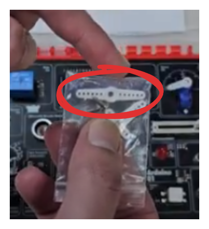
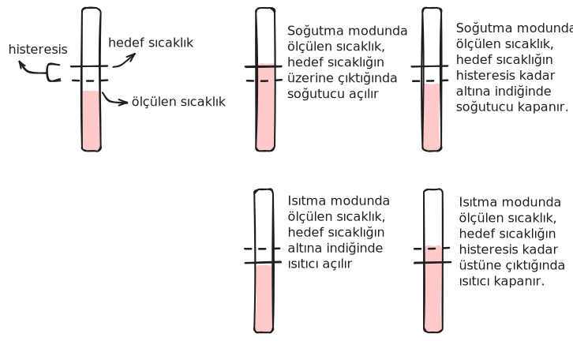

# Useless Machine (Yararsız Makine)

## Giriş

Bu projede, klasik "useless machine" (yararsız makine) konseptini Arduino ile hayata geçireceğiz. Kullanıcı bir potansiyometreyi hareket ettirdiğinde, makine servo motor kullanarak potansiyometreyi geri iterek kendi haline dönmesini sağlıyor. Tabi bunu her seferinde cok mekanik olarak yapsa çok da eğlenceli olmaz. Bu yüzden bu basit konsepti biraz daha ileri götürüp, makineye LCD ekrana çizdiği bir yüz ve mesajlar olan bir "ruh hali sistemi" ve biraz da rastlantısallık ekledik. Böylece makine her seferinde aynı hızda ve aynı şekilde cevap vermediği için biraz daha kişilik sahibi gibi gözüküyor.

**Bu projede öğrenecekleriniz:**

- **Hassas servo motor kalibrasyonu** - Servo'nun tam doğru açıya gelmesi için
- **Çoklu sensör füzyonu** - Birden fazla sensörün birlikte karar vermesi
- **3D baskı entegrasyonu** - Mekanik tasarımla elektronik birleştirme

!!! info "Önceki Bilgiler"
    Bu projede daha önce öğrendiğimiz birçok kavramı kullanacağız:

    - **Servo motorlar**: [Proje 07 - Araba Simülasyonu](../07-araba-simulasyonu.md)'nda öğrenmiştik
    - **Potansiyometre**: [Proje 04 - Potansiyometre](../04-pot.md)'de öğrenmiştik
    - **LCD ekran**: [Proje 08 - LCD Demo](../08-demo.md)'da öğrenmiştik
    - **PIR sensörü**: [Proje 12 - Alarm Sistemi](../12-alarm-sistemi.md)'nde öğrenmiştik
    - **Ultrasonik sensör**: [Proje 06 - Teremin](../06-teremin.md)'de öğrenmiştik
    - **Hysteresis**: [Proje 09 - Termostat](../09-termostat.md)'ta öğrenmiştik
    - **Durum makineleri**: [Proje 08 - LCD Demo](../08-demo.md)'da öğrenmiştik

!!! warning "Gelişmiş Proje"
    Bu proje, 3D yazıcıyla basılması gereken bir parça içerdiği için "Gelişmiş Projeler" kategorisindedir. Servo motor adaptörünü (servo horn adapter) 3D yazıcıyla üretmeniz gerekiyor. Bunun dışında tüm elektronik parçalar kitin içinde bulunmaktadır.

## Gerekli Malzemeler

Bu projede Arduino01 kiti dışında şunlara ihtiyacın olacak:

- **3D basılmış servo kol adaptörü** ([STL dosyasını indir](../files/servo_horn_adapter.STL))
- **Yıldız tornavida** (küçük uçlu - servo vidaları için)

## Montaj ve Kalibrasyon

### Video Anlatım

<iframe width="100%" height="500" src="https://www.youtube.com/embed/EynAUxWnbDI" frameborder="0" allow="accelerometer; autoplay; clipboard-write; encrypted-media; gyroscope; picture-in-picture" allowfullscreen></iframe>


### Servo Adaptör Montajı

Bu projenin en önemli kısmı kitte bulunan servo motorun, potansiyometreyi itebilmesini sağlamak. Bunun için özel bir servo kol adaptörü kullanıyoruz.

**1. 3D Baskı:**

[servo_horn_adapter.STL](../files/servo_horn_adapter.STL) dosyasını indirip 3D yazıcıyla basın:

- Baskı süresi: ~5-10 dakika
- Malzeme kullanımı: ~1 gram
- Herhangi bir standart 3D yazıcıda basılabilir

**2. Servo Kolunu Hazırlama:**

Kitin içinde gelen servo kol paketinde iki farklı kol vardır. Biz **ikili kolu** (iki tarafı olan) kullanacağız.



- 2 adet küçük vida bulun (pakette gelir)
- 3D basılmış adaptörü servo kolunun üzerine yerleştirin
- Servo kolunun yuvarlak kısmı **dışarı bakacak** şekilde konumlandırın
- Vidaları yıldız tornavida ile sıkın (çok küçük uçlu bir yıldız tornavida veya saatçi tornavidası kullanın)

**3. Servo Motor Kalibrasyonu:**

Servo motorun limitini doğru ayarlamak çok önemli. Eğer potansiyometrenin limitinden fazla itmeye çalışırsa servo motorun dişlileri zorlanır ve zarar görebilir.

!!! danger "Önemli Uyarı"
    Servo motor kolunu **asla elinizle zorla çevirmeyin!** İçindeki plastik dişliler zarar görebilir. Özellikle güç varken servoya kesinlikle dokunmayın.

**Kalibrasyon Adımları:**

1. **Orijinal kolu çıkarın:**
   - Arduino'ya USB ile güç vermeyin (güç kesik olmalı)
   - Vidayı çıkarırken servo kolunu tutun (servoya zarar vermemek için)
   - Servo motorun üzerindeki vidayı yıldız tornavida ile çıkarın
   - Kolu yukarı doğru hafifçe çekerek çıkarın

2. **Servo Reset kodunu yükleyin:**
   - Arduino'yu USB ile bağlayın
   - Aşağıdaki `servo_reset.ino` kodunu Arduino IDE'de açın
   - Kodu Arduino'ya yükleyin
   - Yükleme tamamlandığında servodan küçük bir hareket sesi gelecek ve LED yanıp sönmeye başlayacak

3. **Potansiyometreyi ayarlayın:**
   - Potansiyometreyi **en sağ** pozisyona getirins

4. **Servo kolunu takın:**
   - USB'den gücü kesin (kabloyu çekin)
   - Hazırladığınız servo adaptörlü kolu servonun üzerine getirin
   - **Potansiyometreye temas ETMEYEN ama en yakın** pozisyonu bulun
   - Servo kolunun üzerindeki tırtıklar sayesinde birkaç derecelik hassasiyetle ayar yapabilirsiniz
   - Kol ile potansiyometre arasında ~1mm boşluk olmalı

5. **Açıyı ince ayar yapın:**
   - Kolu taktığınız pozisyonda servo kolunu vidayla sabitleyin
   - `servo_reset.ino` dosyasını tekrar açın
   - `servoMax` değerini **1'er 1'er** artırın (örnek: 160 → 161 → 162...)
   - Her değişiklikten sonra kodu tekrar yükleyin
   - Servo kol her yüklemede biraz daha potansiyometreye yaklaşacak
   - Tam değdiği anı bulana kadar devam edin (genellikle 165-166 derece civarı)

```cpp title="servo_reset.ino - Örnek kalibrasyon"
int servoMaks = 160; // Buradan başlayın
// Test edin, potansiyometreye değmediyse:
int servoMaks = 161; // 1 artırın, tekrar yükleyin
// Hala değmediyse:
int servoMaks = 162; // Tekrar 1 artırın
// ...devam edin...
int servoMaks = 166; // Tam değdiği açıyı bulun!
```

6. **Değeri kaydedin:**
   - Bulduğunuz `servoMaks` değerini bir yere not edin (örnek: 166)
   - Bu değeri ana kodda kullanacağız

### Devre Bağlantısı

Bu projede kitin hemen hemen tüm sensörlerini kullanıyoruz! Pin bağlantıları şöyle:

| Komponent | Arduino Pini | Nereden Öğrendik |
|-----------|--------------|------------------|
| Servo motor | Pin 9 | [Proje 07](../07-araba-simulasyonu.md) |
| Potansiyometre | A0 | [Proje 04](../04-pot.md) |
| PIR sensörü | A2 | [Proje 12](../12-alarm-sistemi.md) |
| Ultrasonik Echo | Pin 5 | [Proje 06](../06-teremin.md) |
| Ultrasonik Trigger | Pin 6 | [Proje 06](../06-teremin.md) |
| LCD ekran | I2C (SDA/SCL) | [Proje 08](../08-demo.md) |
| LED | Pin 10 | Kalibrasyon için |

## Kodun Açıklaması

Bu projede iki ayrı kod kullanıyoruz:

1. **servo_reset.ino**: Servo kalibrasyonu için yardımcı kod
2. **useless_machine.ino**: Ana proje kodu

### Servo Reset Kodu

Bu kod servo kalibrasyonu için kullanılır. Servo motorların nasıl çalıştığını [Proje 07](../07-araba-simulasyonu.md)'de öğrenmiştik. Burada servonun hassas kalibrasyonu için özel bir yardımcı kod kullanıyoruz.

```cpp title="servo_reset.ino" linenums="1"
#include <Servo.h>

Servo benimServo;
int ledPini = 10;
int servoPini = 9;

// Bu değeri birer birer arttırarak potansiyometreyi en sağa itecek
// ancak servonun zorlanmayacağı değeri bulacağız.
int servoMaks = 160;

void setup() {
  benimServo.attach(servoPini);
  pinMode(ledPini, OUTPUT);
  benimServo.write(servoMaks);  // Servo'yu maksimum açıya getir
}

void loop() {
  // LED'i yanıp söndür (kalibrasyon tamamlandı göstergesi)
  digitalWrite(ledPini, HIGH);
  delay(500);
  digitalWrite(ledPini, LOW);
  delay(500);
}
```

Kod çok basit: `servoMaks` değişkenini 1'er 1'er artırarak servo kolunun potansiyometreye tam değdiği açıyı bulacağız.

### Ana Proje Kodu

Ana kodumuz servo kontrolü, sensör okumları ve ruh hali sistemi gibi birçok fonksiyonu içeriyor.

```cpp title="useless_machine.ino" linenums="1"
#include <Servo.h>
#include <Adafruit_LiquidCrystal.h>
#include <HCSR04.h>

Adafruit_LiquidCrystal lcd(0x21);
Servo benimServo;
float lux = 0.0f;
float oncekiLux = 0.0f;
int pirPini = A2;
int servoPini = 9;
int potPini = A0;
int suankiRuhHali = -1; // -1: reset, 0: mutlu, 1: sinirli
int servoAcisi = 0;
int servoHizi = 1;
int unsigned long ruhHaliDegisimZamani = 0;
const byte tetikPini = 6;
const byte yankiPini = 5;
UltraSonicDistanceSensor mesafeSensoru(tetikPini, yankiPini);

// ============ AYARLAR ============
int servoMin = 40;
// BURAYA KALİBRASYONDA BULDUĞUNUZ DEĞER GİRECEKSİNİZ!
int servoMaks = 165;
int potEsik = 950;
int servoHizMaks = 15; // Bunu çok artırırsanız servo yakalayamaz. Max 15 uygun
int ruhHaliDegisimServoBekleme = 1000; // Kit sinirlendikten sonra servo en erken ne zaman hareket edecek

// Sinirli mesajlar dizisi
char* mesajDizisi[] = {
  "     ELLEME",
  "  DOKUNMA SUNA",
  "     YAPMA!",
  "     iBiS",
  "   BIRAK SUNU",
  " GUZEL KARDESIM.",
  "  KAYDIRMA SUNU",
  "    KURCALAMA",
  "   OYNAMA"
};
int mesajSayisi = 9;

// Kite ne kadar yakın bir nesne varsa servoyu çalıştırmayacak
// Eğer gereksiz tetikleniyorsa bu değeri düşürebilirsiniz
int mesafeSensoruEsik = 25.0f;

void setup() {
  Serial.begin(9600);
  benimServo.attach(servoPini);
  servoHareketEttir(servoMin);  // Başlangıçta servo geri çekilmiş olsun
  pinMode(pirPini, INPUT);
  lcd.begin(16, 2);
}

void loop() {
  potDegeriKontrolEt();      // Potansiyometre değerini kontrol et
  servoHareketiniYonet();    // Servo hareketini yönet
  delay(50);                 // 50ms bekle (saniyede 20 kontrol)
}

// Servo motoru belirtilen açıya hareket ettir
void servoHareketEttir(int aci){
  // Açıyı minimum ve maksimum değerler arasında sınırla
  if(aci < servoMin) { aci = servoMin; }
  if(aci > servoMaks) { aci = servoMaks; }

  benimServo.write(aci);
  servoAcisi = aci;
}

// Potansiyometre değerini oku ve gerekiyorsa ruh halini değiştir
void potDegeriKontrolEt(){
  int potDegeri = analogRead(potPini);

  // Hysteresis kullanıyoruz (Proje 09'da öğrenmiştik)
  // ±20'lik tolerans ile kararlı okuma sağlıyoruz

  if(suankiRuhHali != 1 && potDegeri < (potEsik - 20)){
    // Potansiyometre aşağı itildi → Sinirli
    ruhHaliDegistir(1);
  }
  else if(suankiRuhHali != 0 && potDegeri > (potEsik + 20)){
    // Potansiyometre yukarı çıktı → Mutlu
    ruhHaliDegistir(0);
  }
}

// Ruh halini değiştir ve LCD'yi güncelle
void ruhHaliDegistir(int yeniRuhHali){
  if(yeniRuhHali == 0){
    // ========== MUTLU MOD ==========

    // Gülen surat çiziyoruz
    lcd.setCursor(6, 0);
    lcd.print(" :)");

    // İkinci satırı temizliyoruz
    lcd.setCursor(0, 1);
    lcd.print("                ");
  }
  else if(yeniRuhHali == 1){
    // ========== SİNİRLİ MOD ==========

    // Şimdiden random bir servo hızı seçeceğiz
    // Hareket daha sonra servoHareketiniYonet()'te gerçekleşecek
    rastgeleServoHizi();

    // Sinirli surat çiziyoruz
    lcd.setCursor(6, 0);
    lcd.print(">(:");

    // Ve bir de laf atıyoruz
    lcd.setCursor(0, 1);
    lcd.print(mesajDizisi[random(0, mesajSayisi)]);
  }

  ruhHaliDegisimZamani = millis();  // Mod değişim zamanını kaydet
  suankiRuhHali = yeniRuhHali;
}

// Rastgele servo hızı seç
void rastgeleServoHizi(){
  /*
   * Rastgele hız seçerken max hızdan daha yüksek bir rastgele sayı 
   * üretip sonra servoHizMaks değeriyle sınırlandırıcaz.
   * Bunun nedeni yavaş hareketlerin daha düşük
   * ihtimalle olmasını sağlamak. Çünkü öyle daha komik bence :)
   */
  servoHizi = random(1, servoHizMaks * 2);
  if(servoHizi > servoHizMaks){
    servoHizi = servoHizMaks;
  }
}

// Servo hareketini yönet (ana kontrol mantığı)
void servoHareketiniYonet(){
  if(suankiRuhHali == 0){
    // MUTLU → Servo geri çekilsin
    if(servoAcisi != servoMin){
      servoHareketEttir(servoMin);
    }
  }
  else if(suankiRuhHali == 1){
    // SİNİRLİ → Sensörleri kontrol et ve hareket et

    int pirOkuma = digitalRead(pirPini);
    Serial.println(pirOkuma);

    float mesafeSensoruOkuma = mesafeSensoru.measureDistanceCm();
    Serial.println(mesafeSensoruOkuma);

    // ÇOKLU SENSÖR FÜZYONU: Üç koşul birden sağlanmalı
    // 1. PIR: Hareket yok (pirOkuma == 0)
    // 2. Mesafe: 25cm'den uzak (güvenlik)
    // 3. Zaman: En az 1 saniye geçmiş (doğal davranış)

    if(pirOkuma == 0 &&
       mesafeSensoruOkuma > mesafeSensoruEsik &&
       millis() > (ruhHaliDegisimZamani + ruhHaliDegisimServoBekleme))
    {
      // Koşullar tamam → Potansiyometreye doğru ilerle
      servoHareketEttir(servoAcisi + servoHizi);
    }
    else {
      // Koşul sağlanmadı → Geri kaç!
      if(servoAcisi != servoMin){
        servoHareketEttir(servoMin);
        ruhHaliDegisimZamani = millis();
        rastgeleServoHizi();  // Tahmin edilemez olsun
      }
    }
  }
}
```

**Kod Detayları:**

#### Ruh Hali Sistemi (State Machine)

[Proje 08](../08-demo.md)'de öğrendiğimiz durum makinesi konseptini kullanarak makineye bir "ruh hali" ekledik. Makine üç farklı durumda olabilir:

- **-1 (Reset)**: İlk başlangıç durumu
- **0 (Mutlu)**: Potansiyometre yukarıda, servo geri çekilmiş, LCD'de `:)` var
- **1 (Sinirli)**: Potansiyometre aşağıda, servo potansiyometreye doğru ilerliyor, LCD'de `>:(` var

Her durum değişiminde LCD'deki emoji ve mesajlar da güncelleniyor. 

#### Hysteresis ile Kararlı Okuma

[Proje 09 - Termostat](../09-termostat.md)'ta öğrendiğimiz **hysteresis** kavramını burada da kullanıyoruz. Potansiyometre değerinin tam eşik noktasında (950) dalgalanması durumunda makine sürekli mod değiştirmesin diye:

- `< 930` olunca → Sinirli
- `> 970` olunca → Mutlu
- `930-970` arası → Değişiklik yok (ölü bölge)



Bu sayede küçük dalgalanmalar durum değişimine sebep olmaz. Detaylı açıklama için [Proje 09](../09-termostat.md)'a bakabilirsin.

#### Çoklu Sensör Füzyonu

Bu projenin en ilginç kısmı: Servo hareket kararını **tek bir sensör değil, üç farklı sensör birlikte** veriyor:

1. **PIR Sensörü** ([Proje 12](../12-alarm-sistemi.md)): Kullanıcı hareket ediyorsa servo geri kaçsın
2. **Mesafe Sensörü** ([Proje 06](../06-teremin.md)): 25cm'den yakın engel varsa çarpma olmasın
3. **Zaman Kontrolü**: Mod değişiminden en az 1 saniye sonra hareket et (daha doğal davranış)

Üç koşul birden sağlanırsa servo ilerler, yoksa geri çekilir. Buna "sensör füzyonu" deniyor - birden fazla sensörün verilerini birleştirerek daha akıllı kararlar vermek.

## Programı Yükleme

--8<-- "snippets/yukleme.md"

**Yükleme Sırası:**

1. İlk önce `servo_reset.ino` ile kalibrasyonu yapın
2. Bulduğunuz açı değerini `useless_machine.ino` dosyasının **23. satırına** yazın
3. `useless_machine.ino` dosyasını yükleyin
4. LCD ekranda `:)` görmelisiniz - makine mutlu!

## Çalışma Mantığı

Proje çalışmaya başladığında:

1. **Başlangıç**: Servo geri çekilmiş durumda (servoMin açısında), LCD'de gülen yüz var
2. **Potansiyometreyi çevirin**: Kullanıcı potansiyometreyi aşağı iterse (analog okuma < 930)
3. **Makine sinirlenir**: LCD'de kızgın yüz ve rastgele bir mesaj belirir
4. **Servo ilerler**: Eğer sensörler hareket algılamazsa, servo potansiyometreye doğru ilerler
5. **Kullanıcı hareket ederse**: PIR sensörü hareketi algılar, servo geri çekilir
6. **Potansiyometre geri döner**: Servo potansiyometreyi iterek geri döndürür
7. **Makine mutlu olur**: Potansiyometre eşiğin üstüne çıkınca (> 970), makine tekrar mutlu olur

## Sorun Giderme

--8<-- "snippets/sorun-giderme.md"

## Geliştirme Fikirleri

Projeyi daha da ileri götürmek isterseniz:

- [ ] Daha fazla ruh hali ekleyin (örnek: "uykulu", "şaşkın")
- [ ] Servo hareketine easing (yavaşlama/hızlanma) ekleyin
- [ ] Piezo buzzer ile sesli geri bildirim ekleyin
- [ ] Farklı servo hız kalıpları oluşturun (hızlı-yavaş-hızlı gibi)

## Özet

Bu proje, hem yazılım hem donanım hem de mekanik tasarımın bir araya geldiği eğlenceli (ve yararsız) bir örnek. Elinize sağlık!
