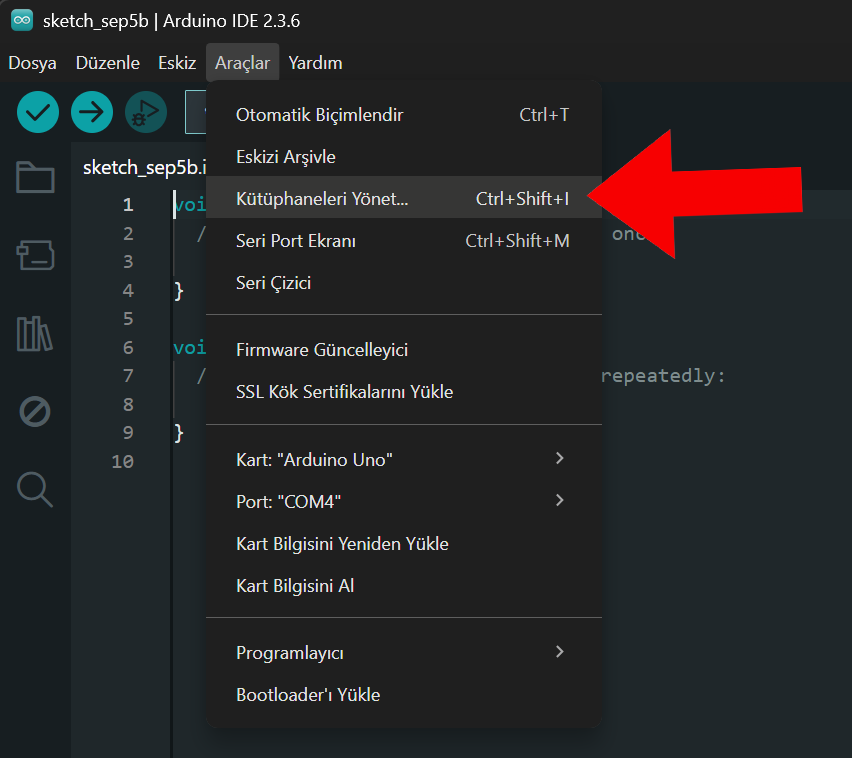
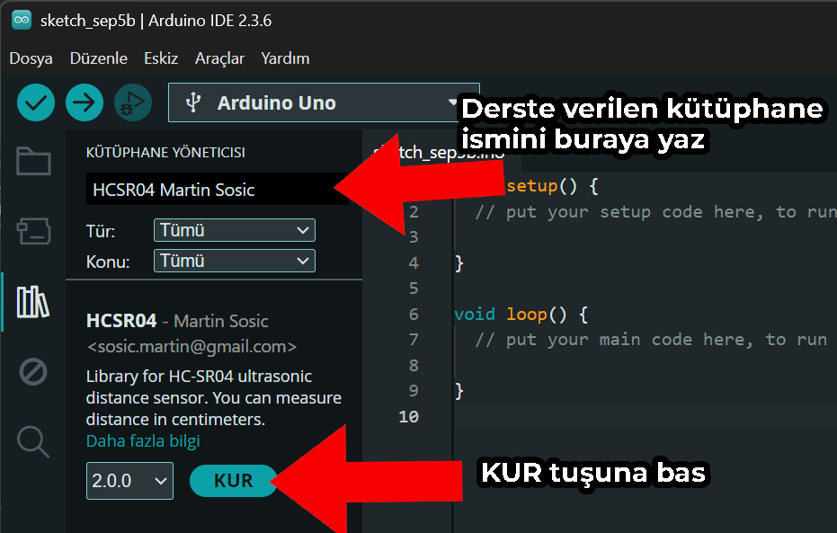

# Kütüphane Kurma

## Giriş

Bazı projeler Arduino IDE'de varsayılan olarak bulunmayan özel kütüphaneler gerektirir. Kütüphaneler, kendi projelerinizde kullanabileceğiniz hazır kodlardır. Mesela bu sayede kitte bulunan ultrasonik mesafeölçer gibi karmaşık sensörleri bile sadece bir iki satır kod yazarak kullanabilirsiniz, çünkü o sensörü kullanmak için aslında gereken sayfalarca kod daha önce bir başkası tarafından yazılmış ve herkes kullansın diye paylaşılmış. 

Proje sayfalarında, o projede hangi kütüphanelerin kullanıldığı belirtiliyor. Bu sayfadaki adımları takip ederek gerekli kütüphanelleri kurabilirsin.

## Adım Adım Kurulum

### 1. Kütüphaneleri Yönet Menüsünü Aç

Arduino IDE'de menüden **Araçlar → Kütüphaneleri Yönet...** seçeneğini tıkla.

### 2. Kütüphaneyi Ara ve Kur

Açılan pencerede:

1. Arama kutusuna proje sayfasında belirtilen kütüphane adını yaz
2. Listeden doğru kütüphaneyi bul
3. **KUR** butonuna tıkla

